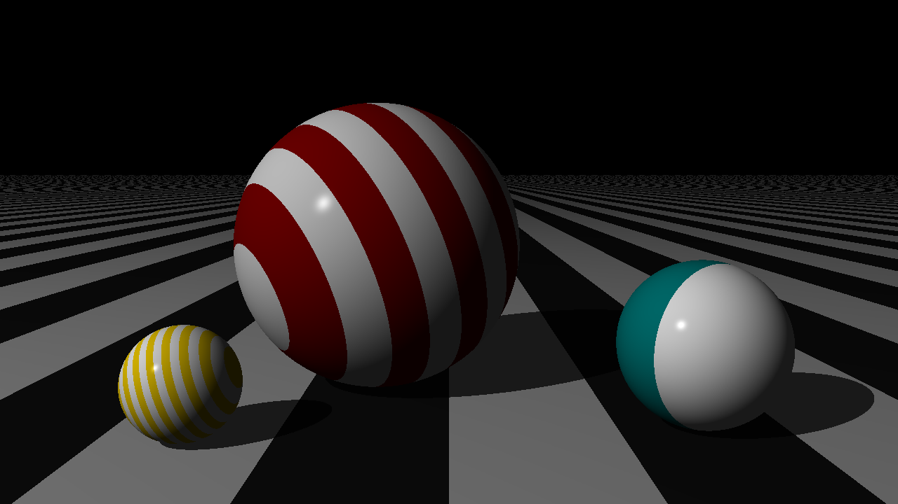
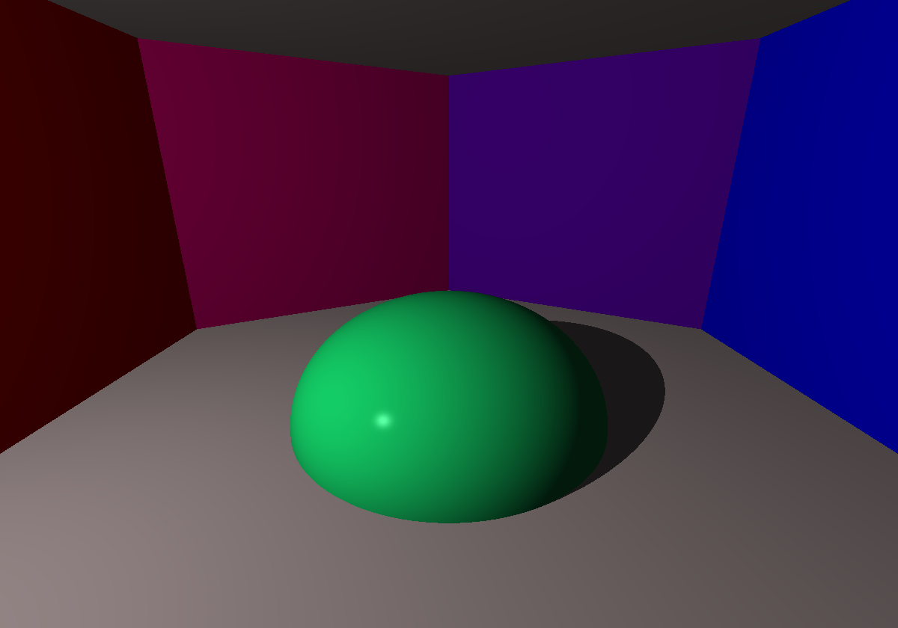
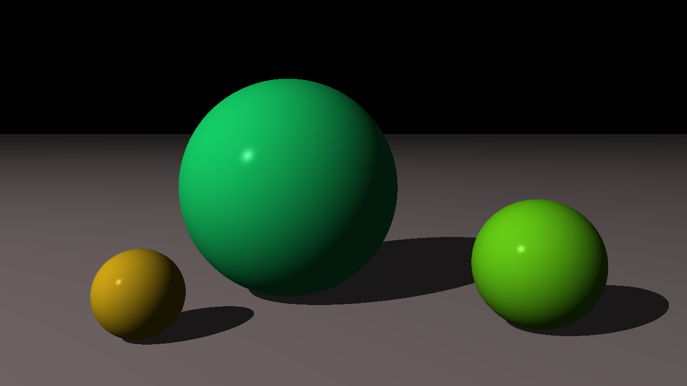
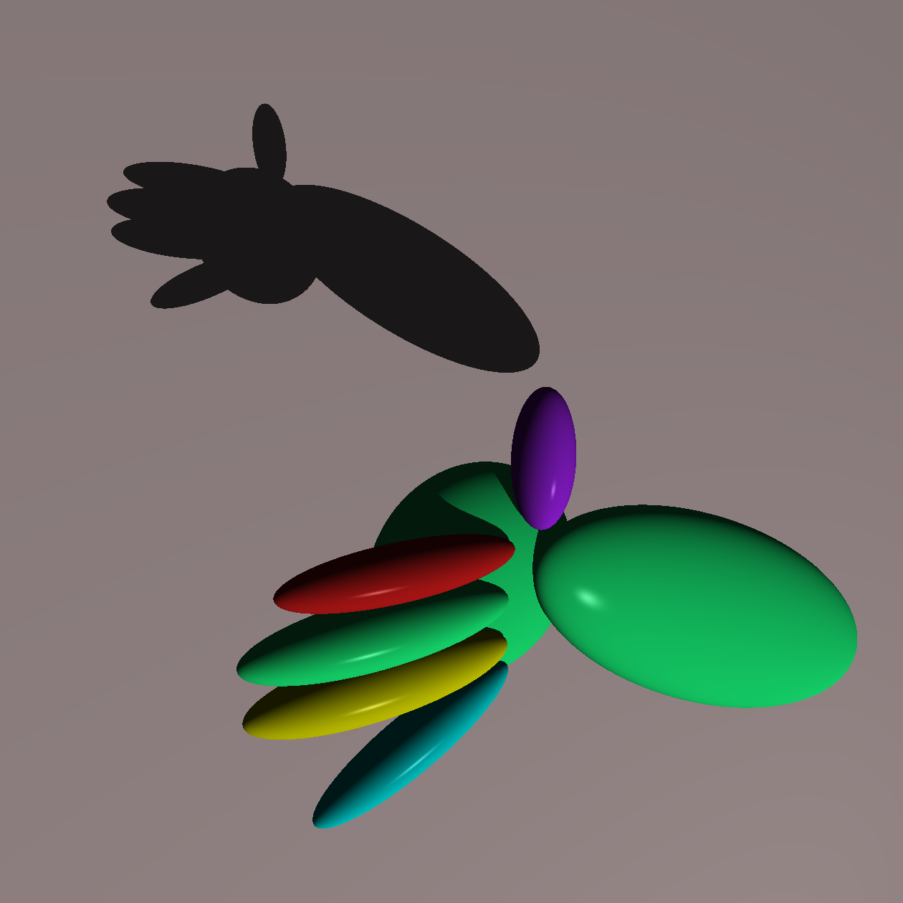
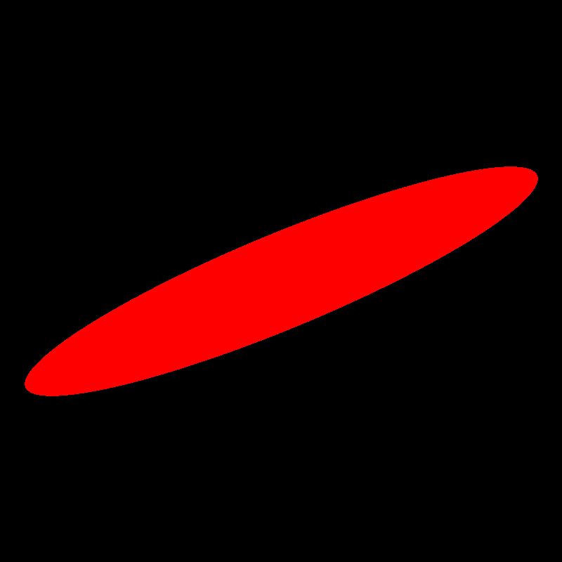

# The Ray Tracer Challenge

My own implementation of the Ray Tracer from the book [The Ray Tracer Challenge: A Test-Driven Guide to Your First 3D Renderer](http://www.raytracerchallenge.com/). While the book provided the test cases and general framework of this project, all of the code written here is created by myself.

## Usage

### Building and running end-of-chapter challenges:

* Edit the `MAIN_FILE_NAME` variable in `./CMakeLists.txt` to the name of the chapter file
* Run the command below:

```bash
 bash ./build.sh
```

### Converting PPM images to PNG

```bash
convert flight_path.ppm flight_path.png
```

## Sample Images

### Patterns



### Spheres and Planes



### Spheres with shadows



### "Hand Puppet"



### Baby's First 3D Rendering


### Deformed Ball



## TODO

### Chapters

- [x] ch1
- [x] ch2
- [x] ch3
- [x] ch4
- [x] ch5
- [x] ch6
- [x] ch7
- [x] ch8
- [x] ch9
- [ ] ch10
- [ ] ch11
- [ ] ch12
- [ ] ch13
- [ ] ch14
- [ ] ch15
- [ ] ch16
- [ ] Bonus chapters (online)

### Code Enhancements

- [x] Move common Shape functionality to a separate file
- [ ] Move Shape objects code into its own folder
- [ ] Move headers into a different folder than source code files
- [ ] Write a function for canvas.h that directly exports image files to .png instead of only to .ppm
- [x] Separate Color class into its own header file
- [ ] Rename all .h files to .hpp


# Rename all *.h to *.hpp
for file in *.h; do
    mv -- "$file" "${file%.h}.hpp"
done