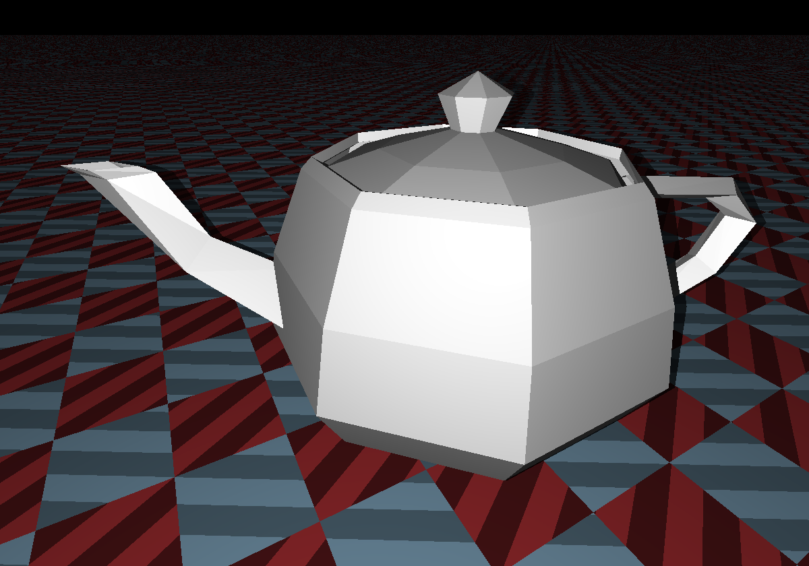
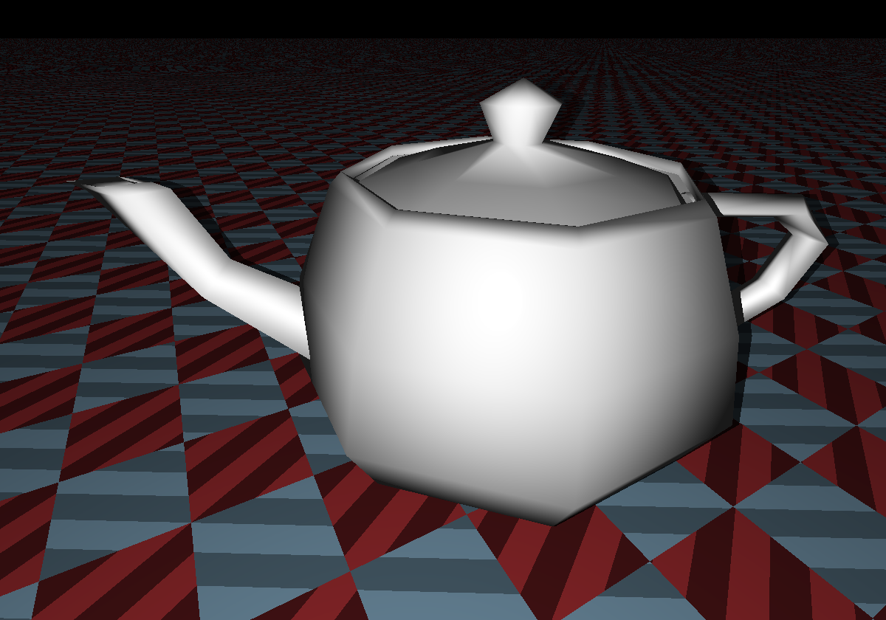
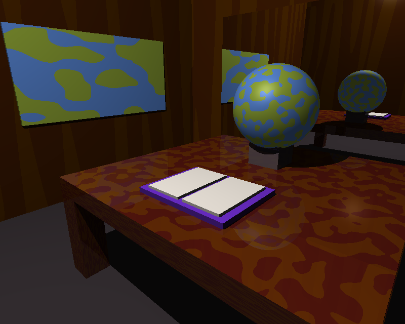
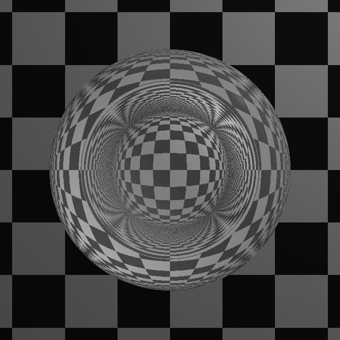
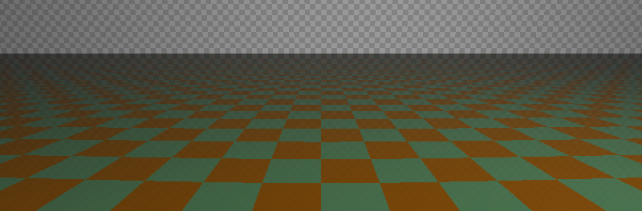
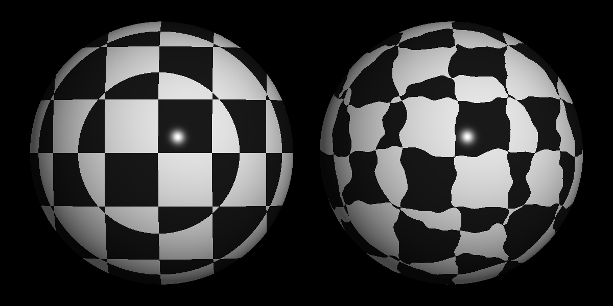
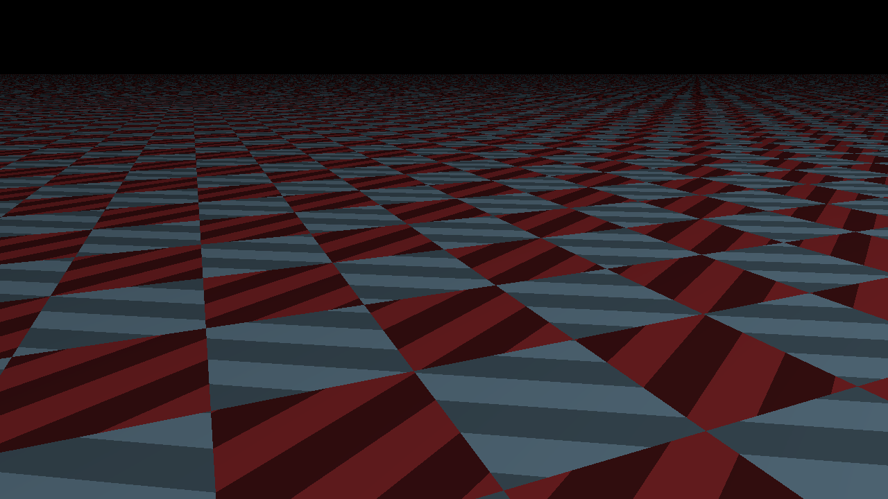

# The Ray Tracer Challenge

My own implementation of the Ray Tracer from the book [The Ray Tracer Challenge: A Test-Driven Guide to Your First 3D Renderer](http://www.raytracerchallenge.com/). While the book provided the test cases and general framework of this project, all of the code written here is created by myself.

## Usage

### Building and running end-of-chapter challenges:

* Edit the `MAIN_FILE_NAME` variable in `./CMakeLists.txt` to the name of the chapter file
* Run the command below:

```bash
 sh ./build.sh && convert values.ppm ./img.png
```

## Sample Images

### .obj Files

 

### Cubes



### Reflection and Refraction





### Patterns





### "Hand Puppet"


### Spheres with shadows


### Baby's First 3D Rendering


## TODO

### Chapters

- [x] ch1
- [x] ch2
- [x] ch3
- [x] ch4
- [x] ch5
- [x] ch6
- [x] ch7
- [x] ch8
- [x] ch9
- [x] ch10
- [x] ch11
- [x] ch12
- [x] ch13
- [x] ch14
- [ ] ch15
- [ ] ch16
- [ ] Bonus chapters (online)
  - [ ] Soft shadows
  - [ ] Bounding Boxes
  - [ ] Texture Mapping

### Code Enhancements

- [x] Move common Shape functionality to a separate file
- [x] Move Shape objects code into its own folder
- [ ] Fix the configuration of the CMake files for the `patterns` and `shapes` dirs such that they don't rely on the parent dirs configuration
- [ ] Move headers into a different folder than source code files
- [ ] Write a function for canvas.h that directly exports image files to .png instead of only to .ppm
- [x] Separate Color class into its own header file
- [x] Rename all .h files to .hpp
- [ ] Fix download location of the PerlinNoise file
- [x] Implement the "Pattern Permuter" Perlin Noise pattern
- [ ] make redundant private attributes into public variables: https://isocpp.github.io/CppCoreGuidelines/CppCoreGuidelines#c131-avoid-trivial-getters-and-setters
- [ ] Use initialization instead of assignment: https://isocpp.github.io/CppCoreGuidelines/CppCoreGuidelines#c49-prefer-initialization-to-assignment-in-constructors
